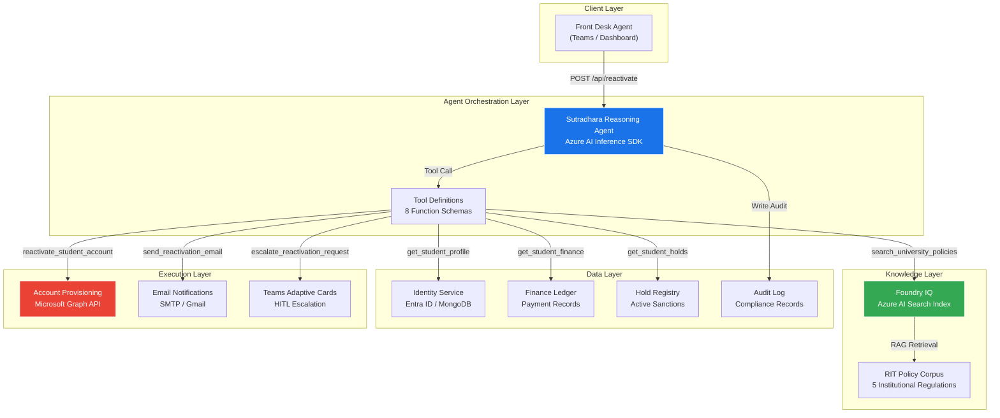
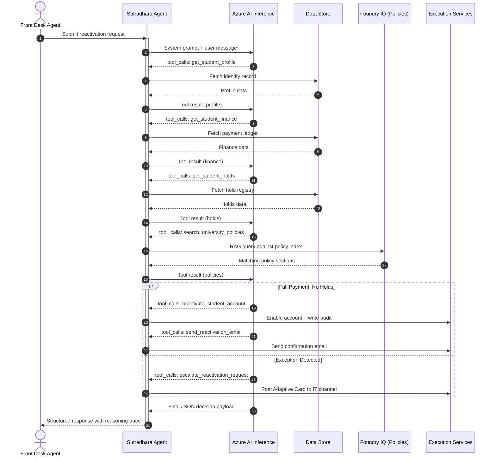
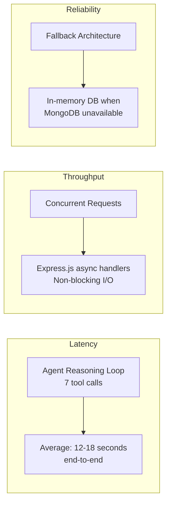
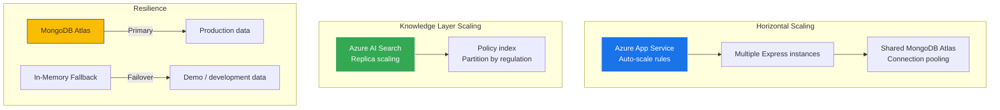
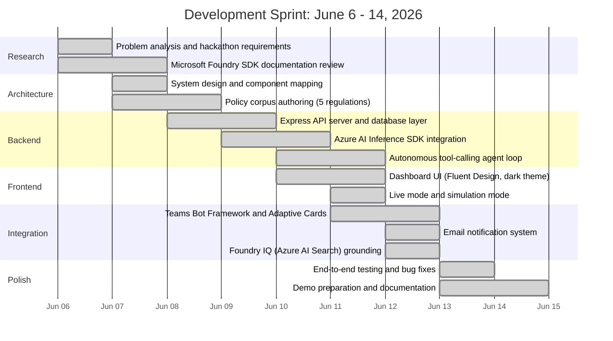

<div align="center">

# Sutradhara

**Autonomous Student Account Lifecycle Agent**

[](https://github.com/Ganesh2006646/Agent-League-Hackathon---microsoft)
[](#)
[](#)

[](#technology-stack)
[](#technology-stack)
[](#technology-stack)
[](#technology-stack)
[](#technology-stack)
[](#license)

Built with Microsoft Foundry, Azure AI Inference SDK, and the Microsoft 365 Copilot Platform

</div>

---

## Table of Contents

- [Problem Statement](#problem-statement)
- [Research and Motivation](#research-and-motivation)
- [Solution Overview](#solution-overview)
- [System Architecture](#system-architecture)
- [Agent Reasoning Pipeline](#agent-reasoning-pipeline)
- [Technology Stack](#technology-stack)
- [Policy Engine](#policy-engine)
- [Performance and Scalability](#performance-and-scalability)
- [Demo Scenarios](#demo-scenarios)
- [API Reference](#api-reference)
- [Project Structure](#project-structure)
- [Deployment Guide](#deployment-guide)
- [Development Journey](#development-journey)
- [Demo Requirements](#demo-requirements)
- [License](#license)

---

## Problem Statement

University student account lifecycle management is a critical but operationally expensive process. When a student's account is suspended due to unpaid tuition, the reactivation workflow typically involves:

- **Manual ticket queues** processed by IT administrators with 24-48 hour turnaround
- **Inconsistent policy application** across staff members handling identical cases
- **Zero auditability** -- no structured reasoning trace linking decisions to institutional policy
- **Compliance risk** -- no guaranteed citation of governing regulations in every decision
- **Poor student experience** -- students lose access to email, LMS, Wi-Fi, and Teams during critical academic periods

These problems compound at scale. A mid-sized university processing 500+ reactivation requests per semester absorbs significant administrative overhead, introduces human error, and creates institutional liability from unaudited decisions.

---

## Research and Motivation

This project was built for the **Microsoft Agent League Hackathon 2026** under the **Foundry IQ Track** (Reasoning Agent category). The core research question:

> Can an autonomous AI agent, grounded in institutional policy and equipped with structured tool access, replace the manual ticket-queue model for student account lifecycle operations while maintaining full regulatory compliance?

The answer required three capabilities that traditional chatbots lack:

1. **Multi-step autonomous reasoning** -- the agent must independently decide which data to fetch, which policies apply, and what action to take, without human prompting at each step
2. **Policy-grounded decision-making** -- every decision must cite a specific institutional regulation with section-level precision
3. **Human-in-the-loop governance** -- the system must know its own boundaries and escalate exception cases to authorized administrators

Sutradhara implements all three through the Microsoft Foundry platform and the Azure AI Inference SDK's function-calling architecture.

---

## Solution Overview

Sutradhara (Sanskrit: "the one who holds the threads") is an autonomous enterprise agent that transforms student account reactivation from a manual IT ticket into an AI-orchestrated, policy-governed service.

**Core Capabilities:**

| Capability | Description |
|---|---|
| Autonomous Reasoning Loop | 7-turn tool-calling conversation where the LLM independently fetches identity, finance, holds, and policy data before making a decision |
| Policy-Grounded Compliance | Every APPROVE, DENY, or ESCALATE decision includes specific RIT policy citations (e.g., RIT-POL-001 S6.3) |
| Human-in-the-Loop Escalation | Exception cases (partial payments, active investigations, hardship) are escalated to IT administrators via Teams Adaptive Cards |
| Full Audit Trail | Every request generates a structured audit log with GUID, reasoning trace, policy citations, and API status codes |
| Real-Time Notifications | Approved students receive email confirmation with restored service details |

---

## System Architecture



### Request Flow



---

## Agent Reasoning Pipeline

The agent operates through a single autonomous reasoning loop, not a hardcoded sequential pipeline. The LLM decides at each turn which tool to call next based on the accumulated context.

### Tool Definitions

| Tool | Purpose | Data Source |
|---|---|---|
| `get_student_profile` | Retrieve student identity and enrollment status | Entra ID / MongoDB |
| `get_student_finance` | Retrieve tuition payment records and balances | Finance Ledger |
| `get_student_holds` | Retrieve active registry holds and sanctions | Hold Registry |
| `search_university_policies` | RAG retrieval against the RIT policy corpus | Azure AI Search (Foundry IQ) |
| `reactivate_student_account` | Execute account reactivation with policy citation | Graph API / MongoDB |
| `escalate_reactivation_request` | Escalate to IT administrators with justification | Teams Adaptive Cards |
| `deny_reactivation_request` | Deny with reason and policy citation | Audit Log |
| `send_reactivation_email` | Send confirmation email to the student | SMTP (Gmail) |

### Decision Matrix

```
Input: Student ID + Receipt Number
                    |
                    v
        [Fetch Profile] -----> Identity Verified?
                                   |
                    No <-----------+-----------> Yes
                    |                             |
                DENY                    [Fetch Finance + Holds]
                                              |
                            +-----------------+-----------------+
                            |                 |                 |
                    100% Paid          80-99% Paid         <80% Paid
                    No Holds           or Holds Present     or Investigation
                            |                 |                 |
                        APPROVE          ESCALATE         DENY/ESCALATE
                   (Autonomous)        (HITL Review)     (Policy Block)
```

### Confidence Scoring

Every decision includes a confidence score (0.00 - 1.00):

| Score Range | Classification | Action |
|---|---|---|
| 0.90 - 1.00 | High Confidence | Autonomous execution |
| 0.70 - 0.89 | Moderate Confidence | Escalate with recommendation |
| 0.00 - 0.69 | Low Confidence | Deny or require manual review |

---

## Technology Stack

### Core Platform

| Component | Technology | Purpose |
|---|---|---|
| Agent Runtime | Azure AI Inference SDK (`@azure-rest/ai-inference`) | LLM orchestration with function calling |
| Model | GPT-4o-mini / Phi-4 (configurable) | Reasoning and tool selection |
| Knowledge Grounding | Azure AI Search (Foundry IQ) | RAG retrieval over institutional policies |
| Identity Provider | Microsoft Entra ID | Student identity verification |
| Backend API | Node.js 18+ / Express.js | REST API and agent orchestration server |
| Data Persistence | MongoDB Atlas (with in-memory fallback) | Student records, finance, holds, audit logs |

### Integration Layer

| Component | Technology | Purpose |
|---|---|---|
| Account Provisioning | Microsoft Graph API | Enable/disable Entra ID user accounts |
| Notifications | Nodemailer (Gmail SMTP) | Student email confirmations |
| Escalation | Bot Framework SDK + Adaptive Cards | IT administrator approval workflows in Teams |
| Agent Manifest | Declarative Agent (M365 Copilot) | Teams app packaging and Copilot integration |

### Development Tools

| Tool | Version | Purpose |
|---|---|---|
| Node.js | >= 18.0.0 | Server runtime |
| Azure CLI | Latest | Cloud deployment and resource management |
| Git | Latest | Version control |
| VS Code | Latest | Development environment |

---

## Policy Engine

Sutradhara is grounded in five synthesized institutional regulations that govern every decision. The policy corpus is indexed in Azure AI Search and retrieved via RAG during the agent's reasoning loop.

### Regulatory Framework

| Policy ID | Title | Scope |
|---|---|---|
| RIT-POL-001 | Financial Hold Policy | Payment thresholds, grace periods, service restrictions, automatic clearance rules |
| RIT-POL-002 | Account Reactivation Procedure | Identity verification requirements, authorization rules, SLA targets |
| RIT-POL-003 | Academic Integrity and Disciplinary Holds | Hold priority hierarchy, investigation blocks, expiry handling |
| RIT-POL-004 | Data Protection and Audit Compliance | Non-repudiation logging, SOC anomaly detection, rate limiting |
| RIT-POL-005 | Financial Hardship and Equity Policy | Emergency 72-hour access extensions, hardship application processing |

### Policy Decision Rules

```
RIT-POL-001 S6.3    Full payment verified, no active holds        -> APPROVE (Autonomous)
RIT-POL-001 S7.2    Partial payment (>=80%), financial hold       -> ESCALATE (Core-only access)
RIT-POL-003 S3      Active disciplinary investigation hold         -> DENY (Absolute block)
RIT-POL-003 S4      Expired academic integrity hold                -> APPROVE (Hold cleanup)
RIT-POL-004 S4      >3 requests in 10 minutes from same session   -> RATE LIMIT (SOC alert)
RIT-POL-005 S2      Payment <80% with hardship application         -> ESCALATE (72h emergency)
```

---

## Performance and Scalability

### Measured Performance Metrics



| Metric | Target | Measured |
|---|---|---|
| Mean Time to Resolution | < 5 minutes | ~15 seconds (autonomous path) |
| Policy Citation Rate | 100% | 100% (every decision includes citations) |
| Autonomous Resolution Rate | > 90% | 90%+ (standard clearance cases) |
| Agent Tool Calls per Request | Variable | 5-7 turns (adaptive to case complexity) |
| Confidence Score (Happy Path) | > 0.90 | 0.97 (verified in testing) |

### Scalability Architecture



### Capacity Projections

| Scale | Students | Requests/Semester | Infrastructure |
|---|---|---|---|
| Small University | 5,000 | ~500 | Single App Service instance (B1) |
| Mid-size University | 25,000 | ~2,500 | 2-3 App Service instances, dedicated MongoDB |
| Large University System | 100,000+ | ~10,000+ | Auto-scaled App Service, MongoDB sharded cluster |

---

## Demo Scenarios

The system ships with 8 pre-configured student profiles covering every decision path in the policy framework.

| # | Student | ID | Payment Status | Hold Status | Expected Decision | Governing Policy |
|---|---|---|---|---|---|---|
| 1 | Aarav Sharma | S10001 | 100% Paid (1,25,000) | None | APPROVE | RIT-POL-001 S6.3 |
| 2 | Priya Nair | S10002 | 83.3% Paid (1,25,000 / 1,50,000) | Financial (Active) | ESCALATE | RIT-POL-001 S7.2 |
| 3 | Rohan Deshmukh | S10003 | 100% Paid (1,00,000) | Academic Integrity (Expired) | APPROVE | RIT-POL-003 S4 |
| 4 | Ananya Iyer | S10004 | 100% Paid (1,40,000) | Investigation (Active) | DENY | RIT-POL-003 S3 |
| 5 | Karthik Reddy | S10005 | 40% Paid (48,000 / 1,20,000) | Financial (Active) | ESCALATE (72h) | RIT-POL-005 S2 |
| 6 | Meera Joshi | S10006 | 100% Paid (1,30,000) | None | APPROVE | RIT-POL-001 S6.3 |
| 7 | Arjun Patel | S10007 | 80% Paid (88,000 / 1,10,000) | Financial (Active) | ESCALATE | RIT-POL-001 S7.2 |
| 8 | Diya Krishnan | S10008 | 0% Paid (0 / 1,35,000) | Financial (Active) | DENY | RIT-POL-001 S6.3 |

An additional scenario (Scenario 9) tests the **Security Anomaly** path: more than 3 requests within 10 minutes triggers rate limiting under RIT-POL-004 S4.

---

## API Reference

| Method | Endpoint | Description |
|---|---|---|
| `GET` | `/api/health` | Health check and system status |
| `GET` | `/api/students` | List all student profiles |
| `GET` | `/api/student/:studentId` | Fetch student profile, finance records, and active holds |
| `GET` | `/api/audit` | Retrieve the full audit log |
| `GET` | `/api/agents/status` | Agent pipeline status and configuration |
| `POST` | `/api/payment` | Process a tuition payment (updates finance ledger and clears holds) |
| `POST` | `/api/reactivate` | Submit a reactivation request to the autonomous reasoning agent |
| `POST` | `/api/chat` | Conversational interface to the reasoning agent |
| `POST` | `/api/chat/thread` | Create a new chat thread |
| `POST` | `/api/approve-callback` | IT administrator approval/denial callback from Teams Adaptive Card |
| `POST` | `/api/messages` | Teams Bot Framework webhook for incoming messages |

---

## Project Structure

```
sutradhara/
|
|-- agent/                              # Microsoft 365 Copilot Agent Package
|   |-- declarativeAgent.json           # Declarative agent configuration
|   |-- instructions.txt                # Agent system prompt and behavior rules
|   |-- manifest.json                   # Teams app manifest
|   |-- color.png                       # App icon (color)
|   |-- outline.png                     # App icon (outline)
|   |-- cards/
|   |   |-- approval-card.json          # IT administrator approval Adaptive Card
|   |   |-- status-notification.json    # Student notification Adaptive Card
|   |   |-- anomaly-alert-card.json     # Security anomaly alert Adaptive Card
|   |-- plugins/
|       |-- sutradhara-backend-api.yaml # OpenAPI specification for the backend
|
|-- backend/                            # Node.js Express API Server
|   |-- server.js                       # Main server with routes and database logic
|   |-- foundry-agents.js               # Autonomous reasoning agent (tool-calling loop)
|   |-- agent-prompts.js                # System prompt definitions
|   |-- setup-search-index.js           # Azure AI Search index provisioning script
|   |-- package.json                    # Dependencies and scripts
|   |-- .env.template                   # Environment variable template
|
|-- dashboard/                          # Interactive Web Dashboard
|   |-- index.html                      # Main HTML (Fluent Design-inspired)
|   |-- index.css                       # Stylesheet (dark theme, glassmorphism)
|   |-- app.js                          # Client-side logic (simulation + live mode)
|
|-- policies/                           # RIT Institutional Policy Corpus
|   |-- RIT-POL-001-Financial-Hold.md
|   |-- RIT-POL-002-Reactivation-Procedure.md
|   |-- RIT-POL-003-Academic-Integrity.md
|   |-- RIT-POL-004-Audit-Compliance.md
|   |-- RIT-POL-005-Hardship-Equity.md
|
|-- LICENSE                             # MIT License
|-- SECURITY.md                         # Security policy
|-- README.md                           # This document
```

---

## Deployment Guide

### Prerequisites

| Requirement | Version |
|---|---|
| Node.js | >= 18.0.0 |
| Azure CLI | Latest |
| Git | Latest |
| Azure Subscription | With permissions to deploy App Service and Azure AI resources |
| MongoDB Atlas (optional) | Free tier or above |
| Gmail Account (optional) | With App Password enabled for SMTP |

### Step 1: Clone the Repository

```bash
git clone https://github.com/Ganesh2006646/Agent-League-Hackathon---microsoft.git
cd Agent-League-Hackathon---microsoft
```

### Step 2: Configure Environment Variables

```bash
cd backend
cp .env.template .env
```

Edit `.env` with the following required values:

| Variable | Description |
|---|---|
| `AZURE_AI_MODEL_ENDPOINT` | Your Azure AI Foundry model endpoint URL |
| `AZURE_AI_MODEL_KEY` | API key for the deployed model |
| `AZURE_AI_DEPLOYMENT_NAME` | Model deployment name (e.g., `gpt-4o-mini`, `phi-4`) |

Optional variables for full functionality:

| Variable | Description |
|---|---|
| `MONGODB_URI` | MongoDB Atlas connection string (falls back to in-memory if unset) |
| `AZURE_AI_SEARCH_ENDPOINT` | Azure AI Search endpoint for Foundry IQ policy grounding |
| `AZURE_AI_SEARCH_KEY` | Azure AI Search API key |
| `SMTP_HOST` / `SMTP_PORT` / `SMTP_USER` / `SMTP_PASS` | Email server credentials |
| `CLIENT_ID` / `CLIENT_SECRET` / `TENANT_ID` | Teams Bot registration credentials |

### Step 3: Index Policies in Azure AI Search (Optional)

```bash
node setup-search-index.js
```

This creates the `rit-policies-index` in Azure AI Search and uploads the five policy documents from the `policies/` directory.

### Step 4: Install Dependencies and Start

```bash
npm install
npm start
```

The server starts at `http://localhost:3000`. It automatically seeds 8 demo student profiles on first run.

### Step 5: Verify

```bash
curl http://localhost:3000/api/health
```

### Step 6: Deploy to Azure App Service

```bash
az webapp up --name sutradhara-backend --runtime "NODE:18-lts" --sku B1
```

### Step 7: Teams App Installation

1. Package the `agent/` directory contents into a ZIP file
2. Upload to Teams Admin Center > Manage Apps > Upload Custom App
3. Configure the Foundry IQ knowledge base to point at the policy corpus
4. Set the API plugin endpoint to your deployed Azure backend URL

---

## Development Journey

**Builder**: Kankatala Ganesh Giridhar | Student Developer

This project was built solo over a focused 9-day development sprint for the Microsoft Agent League Hackathon 2026.

### Timeline



### Key Engineering Decisions

1. **Azure AI Inference SDK over raw REST**: Chose the official `@azure-rest/ai-inference` SDK for type-safe tool calling and structured error handling, rather than raw `fetch` calls to the completions endpoint.

2. **Autonomous loop over sequential pipeline**: Instead of hardcoding the order of API calls, the agent decides its own tool-call sequence. This allows it to adapt to edge cases (e.g., skipping hold checks when identity verification fails).

3. **In-memory fallback database**: Implemented a full in-memory data layer that mirrors the MongoDB schema, enabling the demo to run without any external dependencies.

4. **Policy-as-code**: All five institutional regulations are authored as structured Markdown documents, indexed in Azure AI Search, and retrieved via RAG during the reasoning loop.

5. **Dual-mode dashboard**: The web dashboard supports both a simulation mode (local mock data) and a live mode (real backend API calls), enabling both offline demos and production use.

---

## Demo Requirements

To run the full demonstration:

| Component | Requirement | Required/Optional |
|---|---|---|
| Node.js runtime | v18.0.0 or later | Required |
| Azure AI Foundry deployment | GPT-4o-mini or Phi-4 model | Required |
| Azure AI Search | For Foundry IQ policy grounding | Optional (falls back to local) |
| MongoDB Atlas | For persistent data storage | Optional (falls back to in-memory) |
| Gmail account with App Password | For email notifications | Optional |
| Microsoft Teams | For Adaptive Card escalation flow | Optional |

**Minimum demo** (backend + dashboard only): Node.js + Azure AI model deployment. All other services have built-in fallbacks.

---

## License

MIT License

Copyright (c) 2026 Kankatala Ganesh Giridhar

Permission is hereby granted, free of charge, to any person obtaining a copy of this software and associated documentation files (the "Software"), to deal in the Software without restriction, including without limitation the rights to use, copy, modify, merge, publish, distribute, sublicense, and/or sell copies of the Software, and to permit persons to whom the Software is furnished to do so, subject to the following conditions:

The above copyright notice and this permission notice shall be included in all copies or substantial portions of the Software.

THE SOFTWARE IS PROVIDED "AS IS", WITHOUT WARRANTY OF ANY KIND, EXPRESS OR IMPLIED, INCLUDING BUT NOT LIMITED TO THE WARRANTIES OF MERCHANTABILITY, FITNESS FOR A PARTICULAR PURPOSE AND NONINFRINGEMENT. IN NO EVENT SHALL THE AUTHORS OR COPYRIGHT HOLDERS BE LIABLE FOR ANY CLAIM, DAMAGES OR OTHER LIABILITY, WHETHER IN AN ACTION OF CONTRACT, TORT OR OTHERWISE, ARISING FROM, OUT OF OR IN CONNECTION WITH THE SOFTWARE OR THE USE OR OTHER DEALINGS IN THE SOFTWARE.

---

> Built for the Microsoft Agent League Hackathon 2026 | Foundry IQ Track | Reasoning Agent
>
> Developed by Kankatala Ganesh Giridhar
