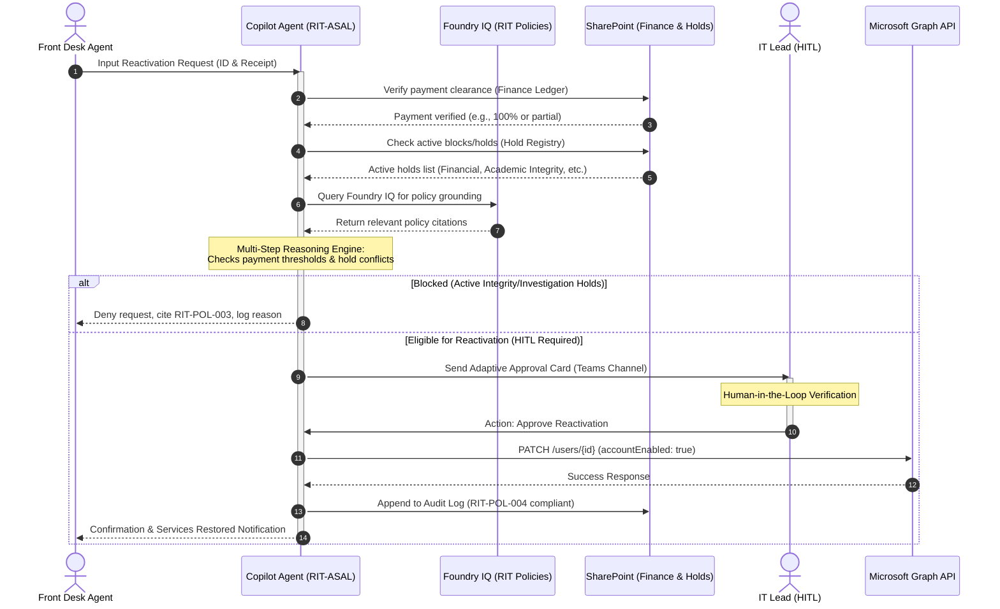

# ASAL — Agentic Student Account Lifecycle System
### Redmond Institute of Technology (RIT) | Enterprise Agents Track | Agents League Hackathon 2026

ASAL is a secure, policy-compliant, and auditable enterprise agent built for Microsoft 365 Copilot and Microsoft Foundry IQ. It automates student IT account reactivations after tuition payment clearance, removing the manual overhead of IT service management.

---

## 🏗️ System Architecture & Workflow



---

## 🛠️ Technology Stack
- **Agent Orchestration**: Microsoft Copilot Studio (Declarative Agent)
- **Knowledge Layer**: Microsoft Foundry IQ (grounded on RIT Policy corpus)
- **Identity & Actions**: Microsoft Graph API (User Lifecycle Management)
- **Data & Audit Trails**: SharePoint Lists (Finance, Holds, and Audit registries)
- **Interface & Approvals**: Microsoft Teams & Adaptive Cards
- **Demo Dashboard**: Fluent-themed HTML5/CSS3/Vanilla JS simulation

---

## 📘 Integrated RIT Policies
ASAL is grounded in the following synthesized RIT regulations:
1. **RIT-POL-001 (Financial Hold Policy)**: Regulates payment grace periods, $500 threshold rules, and service restrictions.
2. **RIT-POL-002 (Account Reactivation Procedure)**: Standardizes authorization rules and SLAs for reactivation.
3. **RIT-POL-003 (Academic Integrity and Disciplinary Holds)**: Enforces hold priority rules (e.g., active disciplinary investigations block financial reactivation).
4. **RIT-POL-004 (Data Protection & Audit Compliance)**: Enforces non-repudiation and logging standards.
5. **RIT-POL-005 (Financial Hardship & Equity Policy)**: Introduces temporary 72-hour emergency access for students experiencing financial hardship.

---

## 📂 Project Directory Structure
```text
├── agent/
│   ├── declarativeAgent.json         # Declarative agent manifest
│   ├── instructions.txt              # System prompt & behavior guidelines
│   ├── manifest.json                 # Teams App package manifest
│   ├── cards/
│   │   ├── approval-card.json        # IT approval Adaptive Card
│   │   ├── status-notification.json  # Student update Adaptive Card
│   │   └── anomaly-alert.json        # Security alert Adaptive Card
│   └── plugins/
│       ├── graph-account-api.yaml    # OpenAPI spec for Microsoft Graph
│       └── sharepoint-finance-api.yaml # OpenAPI spec for SharePoint Lists
├── policies/                         # RIT Policy corpus for Foundry IQ
│   ├── RIT-POL-001-Financial-Hold.md
│   ├── RIT-POL-002-Reactivation-Procedure.md
│   ├── RIT-POL-003-Academic-Integrity.md
│   ├── RIT-POL-004-Audit-Compliance.md
│   └── RIT-POL-005-Hardship-Equity.md
├── sharepoint/                       # List structures and schemas
│   ├── finance-ledger-schema.json
│   ├── hold-registry-schema.json
│   └── audit-log-schema.json
├── dashboard/                        # Interactive simulation dashboard
│   ├── index.html
│   ├── index.css
│   └── app.js
└── README.md
```

---

## 🚀 Setup & Installation (Production Deployment)
1. **SharePoint List Setup**: Create three lists in your SharePoint tenant corresponding to the schemas in `/sharepoint`.
2. **Foundry IQ grounding**: Upload all policy markdown files in `/policies` to your Azure/Foundry subscription to create the policy vector index.
3. **App Registration**: Register an application in Microsoft Entra ID with the following scopes:
   - `User.EnableDisableAccount.All` (least privilege to manage account states)
   - `Sites.ReadWrite.All` (to read/write SharePoint ledger lists)
4. **Agent Packaging**: Zip the `/agent` directory contents (manifest, declarative agent, card JSONs, plugin YAMLs) and upload to the Microsoft 365 Admin Center or Teams App Catalog.

---

## 🔬 Multi-Step Reasoning Scenarios Simulated
- **Scenario 1: Standard Reactivation** (No holds, 100% tuition paid)
- **Scenario 2: Partial Payment Restructure** (Paid ≥80%, receives core-only access per RIT-POL-001 §8)
- **Scenario 3: Expiry Conflict Resolution** (Financial hold cleared, academic integrity hold exists but has expired)
- **Scenario 4: Disciplinary Investigation Block** (Financial hold cleared, but active investigation hold halts automatic reactivation)
- **Scenario 5: Emergency Hardship Extension** (Under 80% paid, but emergency 72-hour access granted under RIT-POL-005 §2)
- **Scenario 6: Rate-Limiting Anomaly Alert** (Bulk reactivation requests within short window trigger security reviews)
