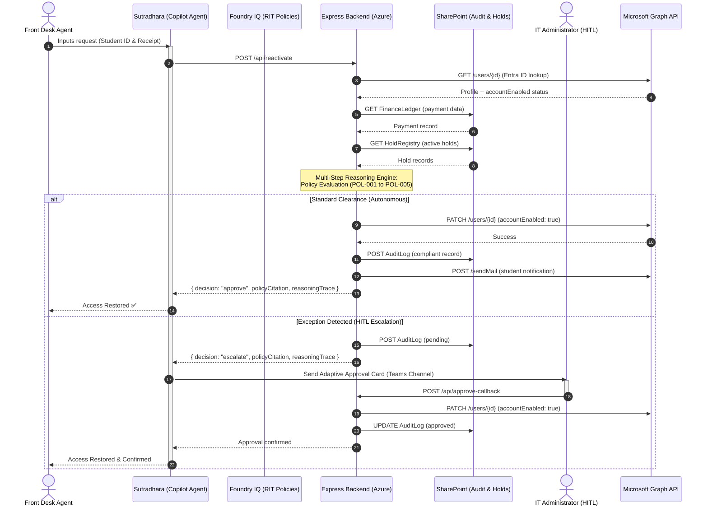

# Sutradhara — Autonomous Student Account Lifecycle Agent
### Redmond Institute of Technology (RIT) | Enterprise Agents Track | Agents League Hackathon 2026

**Sutradhara** is an autonomous enterprise agent built in the Microsoft 365 Copilot ecosystem that turns student account restoration from a manual ticket queue into an AI-orchestrated, policy-driven service. 

By empowering Front Desk/Student Services staff to resolve requests live in a simple Teams chat experience, Sutradhara eliminates the typical 24–48 hour delay, inconsistent verification, and "black box" operational risks associated with account reactivations—all while keeping IT administrators securely in control.

---

## 🏗️ System Architecture & Workflow



---

## 📈 Measurable Key Performance Indicators (KPIs)
Sutradhara captures and proves its business value directly within the SharePoint Audit Log:
1. **Velocity**: Reduces the mean time to restore student access from **24+ hours down to under 5 minutes** post-verification.
2. **Compliance**: Ensures **100% of reactivation actions** are linked directly to specific RIT policy citations with verified financial evidence.
3. **Workload Reduction**: **90%+ of standard requests** are resolved completely autonomously by the agent, leaving only policy exceptions for IT administrator review.

---

## 🛠️ Technology Stack
- **Agent Orchestration**: Microsoft Copilot Studio (Declarative Agent)
- **Knowledge Layer**: Microsoft Foundry IQ (grounded on RIT Policy corpus)
- **Backend API**: Node.js / Express on Azure App Service
- **Identity & Actions**: Microsoft Graph API + Entra ID (User Lifecycle Management)
- **Data & Audit Trails**: SharePoint Lists (FinanceLedger, HoldRegistry, AuditLog)
- **Interface & Approvals**: Microsoft Teams & Adaptive Cards
- **Demo Dashboard**: Fluent-themed HTML5/CSS3/Vanilla JS (simulation + live mode)

---

## 📘 Integrated RIT Policies
Sutradhara is grounded in the following synthesized RIT regulations:
1. **RIT-POL-001 (Financial Hold Policy)**: Regulates payment grace periods, $500 threshold rules, and service restrictions.
2. **RIT-POL-002 (Account Reactivation Procedure)**: Standardizes authorization rules and SLAs for reactivation.
3. **RIT-POL-003 (Academic Integrity and Disciplinary Holds)**: Enforces hold priority rules (e.g., active disciplinary investigations block financial reactivation).
4. **RIT-POL-004 (Data Protection & Audit Compliance)**: Enforces non-repudiation, logging standards, and SOC anomaly detection.
5. **RIT-POL-005 (Financial Hardship & Equity Policy)**: Introduces temporary 72-hour emergency access for students experiencing financial hardship.

---

## 📂 Project Directory Structure
```text
├── agent/
│   ├── declarativeAgent.json         # Declarative agent manifest
│   ├── instructions.txt              # System prompt & behavior guidelines
│   ├── manifest.json                 # Teams App package manifest
│   ├── cards/
│   │   ├── approval-card.json        # IT approval Adaptive Card
│   │   ├── status-notification.json  # Student update Adaptive Card
│   │   └── anomaly-alert.json        # Security alert Adaptive Card
│   └── plugins/
│       └── sutradhara-backend-api.yaml # OpenAPI spec for Express backend
├── backend/                          # 🚀 Live Express backend
│   ├── package.json                  # Node.js dependencies
│   ├── .env.template                 # Environment variable template
│   ├── agent-prompts.js              # System prompts for multi-agent pipeline
│   ├── foundry-agents.js             # Live Azure AI Foundry Agent Pipeline
│   ├── server.js                     # Express API server (MongoDB & Azure integration)
│   └── setup-search-index.js         # Setup and seed Azure AI Search (Foundry IQ)
├── policies/                         # RIT Policy corpus for Foundry IQ
│   ├── RIT-POL-001-Financial-Hold.md
│   ├── RIT-POL-002-Reactivation-Procedure.md
│   ├── RIT-POL-003-Academic-Integrity.md
│   ├── RIT-POL-004-Audit-Compliance.md
│   └── RIT-POL-005-Hardship-Equity.md
├── dashboard/                        # Interactive demo dashboard
│   ├── index.html
│   ├── index.css
│   └── app.js                        # Supports Simulation + Live Mode
└── README.md
```

---

## 🚀 Deployment Guide

### Prerequisites
- Node.js >= 18.0.0
- Azure subscription (with Azure OpenAI or Azure AI Foundry model deployment)
- MongoDB Atlas cluster (optional, falls back to in-memory database)
- SMTP Mail server credentials (optional, for sending real email notifications)

### Step 1: Configure Backend Environment Variables
1. Navigate to the `backend` directory:
   ```bash
   cd backend
   ```
2. Copy the environment configuration template:
   ```bash
   cp .env.template .env
   ```
3. Open `.env` and fill in your real credentials:
   * **Azure AI Foundry:** Add `AZURE_AI_MODEL_ENDPOINT`, `AZURE_AI_MODEL_KEY`, and your deployment model name under `AZURE_AI_DEPLOYMENT_NAME` (e.g., `gpt-4o-mini`, `phi-4`).
   * **MongoDB Atlas (Optional):** Add your Atlas connection string under `MONGODB_URI`. If left unconfigured, the app runs in-memory development mode.
   * **SMTP Server (Optional):** Configure your email server hosts/ports and app passwords for real student email notifications.
   * **Teams Bot credentials (Optional):** Fill in `CLIENT_ID`, `CLIENT_SECRET`, and `TENANT_ID` for registering a Teams App/Bot.

### Step 2: (Optional) Index Policies in Azure AI Search (Foundry IQ)
If you are using Azure AI Search for dynamic policy grounding (Foundry IQ grounding engine):
1. Make sure your `.env` contains your search endpoint, keys, and target index name.
2. Run the indexing helper script to automatically create/update the search index and upload the policy markdown documents:
   ```bash
   node setup-search-index.js
   ```

### Step 3: Install Dependencies and Start the Backend
1. Install project dependencies:
   ```bash
   npm install
   ```
2. Start the Express API server:
   ```bash
   npm start # runs node server.js
   ```
   *For live reloading during development, you can run:*
   ```bash
   npm run dev
   ```
3. The server starts at `http://localhost:3000`. Upon startup, if a MongoDB connection is established, it will automatically check for and seed the 8 demo student profiles.
4. Verify the server is running by hitting the health check endpoint:
   ```bash
   curl http://localhost:3000/api/health
   ```

### Step 4: Deploy to Azure App Service
1. Deploy using Azure CLI:
   ```bash
   az webapp up --name sutradhara-backend --runtime "NODE:18-lts" --sku B1
   ```
2. Or configure a continuous integration workflow in the GitHub Repository deployment settings pointing at your Azure App Service.

### Step 5: Teams App Package
1. Zip the contents of the `agent/` folder (including `manifest.json`, `declarativeAgent.json`, `cards/`, and `plugins/`).
2. Upload this zip file to **Teams Admin Center** -> **Manage apps** -> **Upload custom app** or install via VS Code Teams Toolkit.

### Step 6: Copilot Studio Configuration
1. Go to **Copilot Studio** -> **Create** -> **Declarative Agent**.
2. Import the `declarativeAgent.json` configuration.
3. Configure the **Foundry IQ** knowledge base pointing it at the `/policies` folder (or a synced SharePoint document library containing the markdown files).
4. Set the API plugin connection to point at your deployed Azure backend domain endpoint.
5. Test the integration in the Copilot Studio test pane.

---

## 🔬 End-to-End Demo Stories

| Scenario | Student | Payment | Holds | Expected Decision | Policy |
|----------|---------|---------|-------|-------------------|--------|
| 1. Happy Path | Aarav Sharma (S10001) | 100% (₹1.25L) | None | ✅ APPROVE FULL | RIT-POL-001 §6.3 |
| 2. Partial Payment | Priya Nair (S10002) | 83.3% (₹1.25L/₹1.5L) | Financial (Active) | ⚠️ ESCALATE | RIT-POL-001 §7.2 |
| 3. Expired Hold | Rohan Deshmukh (S10003) | 100% (₹1L) | AcademicIntegrity (Expired) | ✅ APPROVE FULL | RIT-POL-003 §4 |
| 4. Active Investigation | Ananya Iyer (S10004) | 100% (₹1.4L) | Investigation (Active) | ❌ DENY | RIT-POL-003 §3 |
| 5. Hardship Case | Karthik Reddy (S10005) | 40% (₹48K/₹1.2L) | Financial (Active) | ⚠️ ESCALATE (72h Access) | RIT-POL-005 §2 |
| 6. Good Standing | Meera Joshi (S10006) | 100% (₹1.3L) | None | ✅ APPROVE FULL | RIT-POL-001 §6.3 |
| 7. Partial Payment Limit | Arjun Patel (S10007) | 80% (₹88K/₹1.1L) | Financial (Active) | ⚠️ ESCALATE | RIT-POL-001 §7.2 |
| 8. Unpaid Balance | Diya Krishnan (S10008) | 0% (₹0/₹1.35L) | Financial (Active) | ❌ DENY | RIT-POL-001 §6.3 |
| 9. Security Anomaly | — | — | — | 🚨 RATE LIMIT | RIT-POL-004 §4 |

---

## 🧪 API Endpoints

| Method | Endpoint | Description |
|--------|----------|-------------|
| `GET` | `/api/health` | Health check |
| `GET` | `/api/student/:studentId` | Fetch student profile + finance + holds |
| `POST` | `/api/reactivate` | Process reactivation (reasoning engine) |
| `POST` | `/api/approve-callback` | IT approval/denial callback |

---

## 📄 License
MIT License — Microsoft Agents League Hackathon 2026
