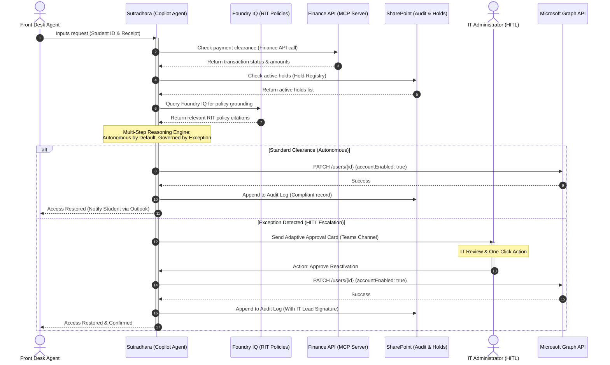

# Sutradhara — Autonomous Student Account Lifecycle Agent
### Redmond Institute of Technology (RIT) | Enterprise Agents Track | Agents League Hackathon 2026

**Sutradhara** is an autonomous enterprise agent built in the Microsoft 365 Copilot ecosystem that turns student account restoration from a manual ticket queue into an AI-orchestrated, policy-driven service. 

By empowering Front Desk/Student Services staff to resolve requests live in a simple Teams chat experience, Sutradhara eliminates the typical 24–48 hour delay, inconsistent verification, and "black box" operational risks associated with account reactivations—all while keeping IT administrators securely in control.

---

## 🏗️ System Architecture & Workflow



---

## 📈 Measurable Key Performance Indicators (KPIs)
Sutradhara captures and proves its business value directly within the SharePoint Audit Log:
1. **Velocity**: Reduces the mean time to restore student access from **24+ hours down to under 5 minutes** post-verification.
2. **Compliance**: Ensures **100% of reactivation actions** are linked directly to specific RIT policy citations with verified financial evidence.
3. **Workload Reduction**: **90%+ of standard requests** are resolved completely autonomously by the agent, leaving only policy exceptions for IT administrator review.

---

## 🛠️ Technology Stack
- **Agent Orchestration**: Microsoft Copilot Studio (Declarative Agent)
- **Knowledge Layer**: Microsoft Foundry IQ (grounded on RIT Policy corpus)
- **Integration Layer**: Model Context Protocol (MCP) connected to University Finance APIs
- **Identity & Actions**: Microsoft Graph API (User Lifecycle Management)
- **Data & Audit Trails**: SharePoint Lists (Holds and Compliance Audit registries)
- **Interface & Approvals**: Microsoft Teams & Adaptive Cards
- **Demo Dashboard**: Fluent-themed HTML5/CSS3/Vanilla JS simulation

---

## 📘 Integrated RIT Policies
Sutradhara is grounded in the following synthesized RIT regulations:
1. **RIT-POL-001 (Financial Hold Policy)**: Regulates payment grace periods, $500 threshold rules, and service restrictions.
2. **RIT-POL-002 (Account Reactivation Procedure)**: Standardizes authorization rules and SLAs for reactivation.
3. **RIT-POL-003 (Academic Integrity and Disciplinary Holds)**: Enforces hold priority rules (e.g., active disciplinary investigations block financial reactivation).
4. **RIT-POL-004 (Data Protection & Audit Compliance)**: Enforces non-repudiation, logging standards, and SOC anomaly detection.
5. **RIT-POL-005 (Financial Hardship & Equity Policy)**: Introduces temporary 72-hour emergency access for students experiencing financial hardship.

---

## 📂 Project Directory Structure
```text
├── agent/
│   ├── declarativeAgent.json         # Declarative agent manifest
│   ├── instructions.txt              # System prompt & behavior guidelines
│   ├── manifest.json                 # Teams App package manifest
│   ├── cards/
│   │   ├── approval-card.json        # IT approval Adaptive Card
│   │   ├── status-notification.json  # Student update Adaptive Card
│   │   └── anomaly-alert.json        # Security alert Adaptive Card
│   └── plugins/
│       ├── graph-account-api.yaml    # OpenAPI spec for Microsoft Graph
│       └── sharepoint-finance-api.yaml # OpenAPI spec for SharePoint Lists
├── policies/                         # RIT Policy corpus for Foundry IQ
│   ├── RIT-POL-001-Financial-Hold.md
│   ├── RIT-POL-002-Reactivation-Procedure.md
│   ├── RIT-POL-003-Academic-Integrity.md
│   ├── RIT-POL-004-Audit-Compliance.md
│   └── RIT-POL-005-Hardship-Equity.md
├── sharepoint/                       # List structures and schemas
│   ├── finance-ledger-schema.json
│   ├── hold-registry-schema.json
│   └── audit-log-schema.json
├── dashboard/                        # Interactive simulation dashboard
│   ├── index.html
│   ├── index.css
│   └── app.js
└── README.md
```

---

## 🔬 End-to-End Demo Stories Simulated
- **Story 1: The Happy Path (Autonomous Clearance)**: A Front Desk operator uploads a payment receipt in Teams. Sutradhara calls the Finance MCP tool, verifies payment, confirms no registry holds, calls Graph API to reactivate, writes the audit log, and notifies the student via email in under 10 seconds.
- **Story 2: The Exception Path (Governed by Exception)**: A student has paid tuition, but has an active hold. Sutradhara identifies the conflict, blocks autonomous execution, compiles a recommendation packet citing policy, and escalates to the IT channel via a Teams Adaptive Card for manual review.
- **Story 3: Anomaly & Rate Spikes**: Suspiciously high request volumes automatically trigger safety throttling and escalate to the Security Operations Center (SOC).
