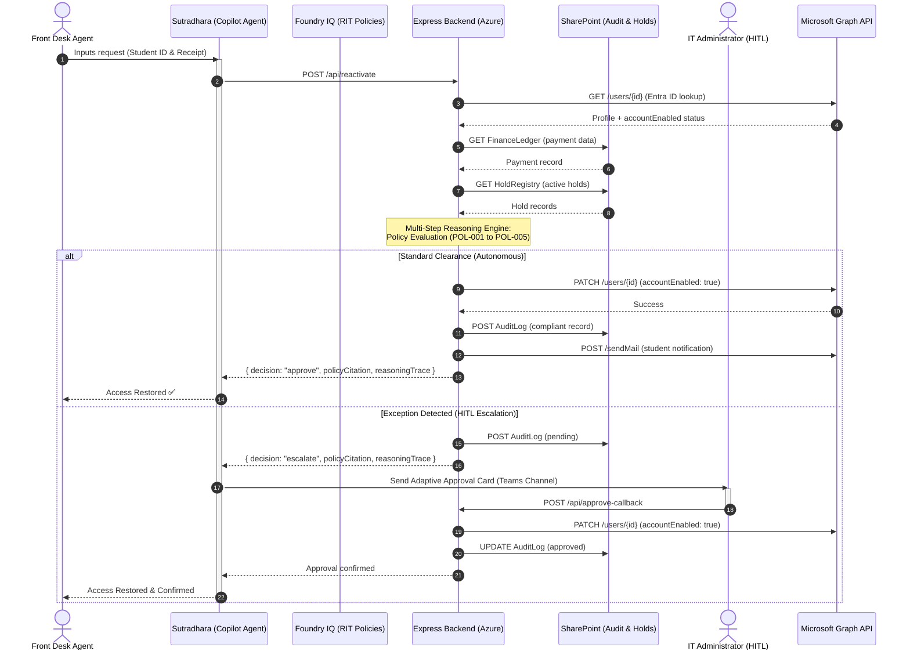

# Sutradhara — Autonomous Student Account Lifecycle Agent
### Redmond Institute of Technology (RIT) | Enterprise Agents Track | Agents League Hackathon 2026

**Sutradhara** is an autonomous enterprise agent built in the Microsoft 365 Copilot ecosystem that turns student account restoration from a manual ticket queue into an AI-orchestrated, policy-driven service. 

By empowering Front Desk/Student Services staff to resolve requests live in a simple Teams chat experience, Sutradhara eliminates the typical 24–48 hour delay, inconsistent verification, and "black box" operational risks associated with account reactivations—all while keeping IT administrators securely in control.

---

## 🏗️ System Architecture & Workflow



---

## 📈 Measurable Key Performance Indicators (KPIs)
Sutradhara captures and proves its business value directly within the SharePoint Audit Log:
1. **Velocity**: Reduces the mean time to restore student access from **24+ hours down to under 5 minutes** post-verification.
2. **Compliance**: Ensures **100% of reactivation actions** are linked directly to specific RIT policy citations with verified financial evidence.
3. **Workload Reduction**: **90%+ of standard requests** are resolved completely autonomously by the agent, leaving only policy exceptions for IT administrator review.

---

## 🛠️ Technology Stack
- **Agent Orchestration**: Microsoft Copilot Studio (Declarative Agent)
- **Knowledge Layer**: Microsoft Foundry IQ (grounded on RIT Policy corpus)
- **Backend API**: Node.js / Express on Azure App Service
- **Identity & Actions**: Microsoft Graph API + Entra ID (User Lifecycle Management)
- **Data & Audit Trails**: SharePoint Lists (FinanceLedger, HoldRegistry, AuditLog)
- **Interface & Approvals**: Microsoft Teams & Adaptive Cards
- **Demo Dashboard**: Fluent-themed HTML5/CSS3/Vanilla JS (simulation + live mode)

---

## 📘 Integrated RIT Policies
Sutradhara is grounded in the following synthesized RIT regulations:
1. **RIT-POL-001 (Financial Hold Policy)**: Regulates payment grace periods, $500 threshold rules, and service restrictions.
2. **RIT-POL-002 (Account Reactivation Procedure)**: Standardizes authorization rules and SLAs for reactivation.
3. **RIT-POL-003 (Academic Integrity and Disciplinary Holds)**: Enforces hold priority rules (e.g., active disciplinary investigations block financial reactivation).
4. **RIT-POL-004 (Data Protection & Audit Compliance)**: Enforces non-repudiation, logging standards, and SOC anomaly detection.
5. **RIT-POL-005 (Financial Hardship & Equity Policy)**: Introduces temporary 72-hour emergency access for students experiencing financial hardship.

---

## 📂 Project Directory Structure
```text
├── agent/
│   ├── declarativeAgent.json         # Declarative agent manifest
│   ├── instructions.txt              # System prompt & behavior guidelines
│   ├── manifest.json                 # Teams App package manifest
│   ├── cards/
│   │   ├── approval-card.json        # IT approval Adaptive Card
│   │   ├── status-notification.json  # Student update Adaptive Card
│   │   └── anomaly-alert.json        # Security alert Adaptive Card
│   └── plugins/
│       ├── graph-account-api.yaml    # OpenAPI spec for Microsoft Graph
│       ├── sharepoint-finance-api.yaml # OpenAPI spec for SharePoint Lists
│       └── sutradhara-backend-api.yaml # OpenAPI spec for Express backend
├── backend/                          # 🚀 Live Express backend
│   ├── package.json                  # Node.js dependencies
│   ├── .env.example                  # Environment variable template
│   ├── graph-client.js               # Microsoft Graph SDK initialization
│   ├── server.js                     # Express API server (4 routes + reasoning)
│   ├── setup-sharepoint.js           # SharePoint list provisioning script
│   └── seed-demo-data.js             # Demo student account + data seeder
├── policies/                         # RIT Policy corpus for Foundry IQ
│   ├── RIT-POL-001-Financial-Hold.md
│   ├── RIT-POL-002-Reactivation-Procedure.md
│   ├── RIT-POL-003-Academic-Integrity.md
│   ├── RIT-POL-004-Audit-Compliance.md
│   └── RIT-POL-005-Hardship-Equity.md
├── sharepoint/                       # List structures and schemas
│   ├── finance-ledger-schema.json
│   ├── hold-registry-schema.json
│   └── audit-log-schema.json
├── dashboard/                        # Interactive demo dashboard
│   ├── index.html
│   ├── index.css
│   └── app.js                        # Supports Simulation + Live Mode
└── README.md
```

---

## 🚀 Deployment Guide

### Prerequisites
- Node.js >= 18.0.0
- Azure subscription (with App Service plan)
- Microsoft 365 tenant with admin access
- SharePoint site created

### Step 1: Azure App Registration (Entra ID)
1. Go to **Azure Portal** → **Microsoft Entra ID** → **App registrations** → **New registration**
2. Name: `Sutradhara Backend`
3. Supported account types: **Single tenant**
4. After creating, note the **Application (client) ID** and **Directory (tenant) ID**
5. Go to **Certificates & secrets** → **New client secret** → copy the secret value
6. Go to **API permissions** → Add these **Application permissions**:
   - `User.ReadWrite.All` (read/write user profiles, enable/disable accounts)
   - `Sites.ReadWrite.All` (read/write SharePoint lists)
   - `Mail.Send` (send notification emails)
7. Click **Grant admin consent**

### Step 2: Get SharePoint Site ID
```powershell
# After setting up .env with TENANT_ID, CLIENT_ID, CLIENT_SECRET:
# Use Graph Explorer or this curl command:
# GET https://graph.microsoft.com/v1.0/sites/{your-tenant}.sharepoint.com:/sites/{site-name}
# Copy the "id" field → this is your SHAREPOINT_SITE_ID
```

### Step 3: Configure Backend
```bash
cd backend
cp .env.example .env
# Edit .env with your real values:
#   TENANT_ID=your-tenant-id
#   CLIENT_ID=your-client-id
#   CLIENT_SECRET=your-client-secret
#   SHAREPOINT_SITE_ID=your-site-id
#   TEAMS_WEBHOOK_URL=your-webhook-url (optional)
#   DOMAIN=your-domain.onmicrosoft.com
npm install
```

### Step 4: Provision SharePoint Lists
```bash
npm run setup
# Creates: FinanceLedger, HoldRegistry, AuditLog with all columns
```

### Step 5: Create Demo Student Accounts
```bash
npm run seed
# Creates 5 demo students in Entra ID + seeds finance/hold data
```

### Step 6: Start the Backend
```bash
npm start
# Server starts at http://localhost:3000
# Test: curl http://localhost:3000/api/health
```

### Step 7: Deploy to Azure App Service
```bash
# Option A: Azure CLI
az webapp up --name sutradhara-backend --runtime "NODE:18-lts" --sku B1

# Option B: GitHub Actions (push to main → auto-deploy)
# Configure in Azure Portal → Deployment Center → GitHub
```

### Step 8: Teams App Package
1. Zip the `agent/` folder contents (manifest.json, declarativeAgent.json, cards/, plugins/)
2. Upload to **Teams Admin Center** → **Manage apps** → **Upload custom app**
3. Or use **Teams Toolkit** in VS Code to deploy

### Step 9: Copilot Studio Configuration
1. Go to **Copilot Studio** → **Create** → **Declarative Agent**
2. Import the `declarativeAgent.json`
3. Configure the **Foundry IQ** knowledge base with the `/policies` folder
4. Set the API plugin connection to point at your Azure backend URL
5. Test in the Copilot Studio test pane

---

## 🔬 End-to-End Demo Stories

| Scenario | Student | Payment | Holds | Expected Decision | Policy |
|----------|---------|---------|-------|-------------------|--------|
| 1. Happy Path | Alice Vance (S12345) | 100% ($12K) | None | ✅ APPROVE FULL | RIT-POL-001 §6.3 |
| 2. Partial Payment | Bob Carter (S12346) | 83% ($12.5K/$15K) | Financial (Active) | ⚠️ ESCALATE | RIT-POL-001 §7.2 |
| 3. Expired Hold | Charlie Miller (S12347) | 100% ($10K) | AcademicIntegrity (Expired) | ✅ APPROVE FULL | RIT-POL-003 §4 |
| 4. Active Investigation | Diana Prince (S12348) | 100% ($14K) | Investigation (Active) | ❌ DENY | RIT-POL-003 §3 |
| 5. Hardship Case | Ethan Hunt (S12349) | 40% ($4.8K/$12K) | Financial (Active) | ❌ DENY | RIT-POL-001 §7.2 |
| 6. Security Anomaly | — | — | — | 🚨 RATE LIMIT | RIT-POL-004 §4 |

---

## 🧪 API Endpoints

| Method | Endpoint | Description |
|--------|----------|-------------|
| `GET` | `/api/health` | Health check |
| `GET` | `/api/student/:studentId` | Fetch student profile + finance + holds |
| `POST` | `/api/reactivate` | Process reactivation (reasoning engine) |
| `POST` | `/api/approve-callback` | IT approval/denial callback |

---

## 📄 License
MIT License — Microsoft Agents League Hackathon 2026
